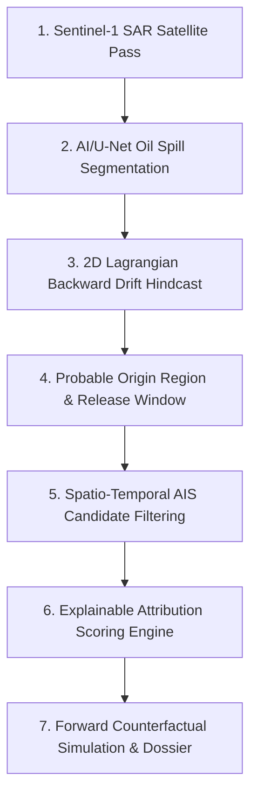

# OCEAN-EYE — Maritime Geospatial Intelligence & Oil Spill Attribution System

> **Geospatial Investigation-Support Prototype for Marine Pollution Attribution**  
> Integrating Sentinel-1 SAR observations, 2D Lagrangian hydrodynamic backward drift modeling, AIS vessel telemetry correlation, and explainable multi-factor Bayesian evidence ranking.

---

## 🌊 Overview & System Scope

**OCEAN-EYE** is an investigation-support prototype engineered to assist maritime environmental authorities in detecting, tracking, and analyzing offshore marine pollution events. When a Synthetic Aperture Radar (SAR) satellite pass detects an offshore oil slick, the platform hindcasts the slick's backward dispersion using ocean surface currents and wind fields to reconstruct the probable release origin corridor and release-time window, correlates it with historical and real-time AIS vessel tracks, evaluates counterfactual forward transport hypotheses, and compiles a structured evidence provenance dossier for human-in-the-loop analyst review.

> [!NOTE]
> **Operational Scope & Scientific Grounding**:
> - **Investigation-Support Prototype**: Designed to prioritize candidates and synthesize evidence provenance, not provide automated legal liability determinations.
> - **Discrete Satellite Observations**: Satellite radar imagery represents discrete temporal snapshots rather than continuous real-time video.
> - **Near-Real-Time AIS**: Ingestion of live AIS is supported where API provider coverage permits, with explicit data status tags (`LIVE`, `HISTORICAL`, `DEMO`, `SIMULATED`, `ESTIMATED`, `OFFLINE`).

---

## 📡 Operational Modes & Data Provenance

Every data element within OCEAN-EYE exposes transparent data status indicators:

| Mode / Tag | Definition | Behavior in Platform |
| :--- | :--- | :--- |
| `LIVE` | Live feed fetched directly from active external APIs | DataDocked & MyShipTracking real-time AIS stream via `/ws/ais` when valid credentials are provided in `.env`. |
| `HISTORICAL` | Actual archived sensor passes or historical AIS trajectories | Historical vessel voyages, verified Sentinel-1 scene footprints, and archived metocean records. |
| `DEMO` | Calibrated benchmark incident (Sector 7 Mumbai High) | Deterministic evaluation dataset for offline demos, hackathons, and reproducible benchmarking. |
| `SIMULATED` | Physics-based numerical integration output | Dynamic 2D backward Lagrangian drift particles and forward counterfactual slick geometries. |
| `ESTIMATED` | Statistical inference and corridor estimation | Origin ellipse bounding contours, release-time brackets, and speed/heading interpolations. |
| `OFFLINE` | External provider unavailable / quota exceeded | Resilient graceful fallback returning explicit OFFLINE status without fabricated live data. |

---

## 🎯 7-Step Forensics & Attribution Chain



1. **Satellite Acquisition**: Ingests Sentinel-1 C-band SAR scenes with dual-polarization (VV/VH) and look-alike rejection filters.
2. **Spill Segmentation**: Identifies slick polygons, major/minor axes, orientation, contrast ratios (dB), and geometric centroids.
3. **Hydrodynamic Hindcast**: Numerically computes backward Lagrangian particle transport ($dX/dt = -(\vec{U}_{\text{current}} + \text{windage} \cdot \vec{U}_{\text{wind}} + \vec{D}_{\text{turbulent}})$).
4. **Origin & Release Window**: Dynamically calculates probable release centroid, bounding ellipse, and temporal window (e.g. `06:00–10:00 UTC`).
5. **AIS Filtering**: Funnels regional AIS vessel tracks down to spatio-temporally intersecting candidates using great-circle distance and temporal overlap bounds.
6. **Explainable Attribution**: Dynamic 6-factor Bayesian scoring (Proximity 25%, Temporal 20%, Drift 20%, Trajectory 15%, Speed Profile 10%, AIS Continuity 10%) with explicit data provenance.
7. **Counterfactual Validation**: Simulates forward release from candidate tracks and calculates actual intersection-over-union (IoU) and centroid displacement metrics against observed slicks.

---

## 🚀 Core Platform Capabilities

- 🗺️ **Full-Bleed ECDIS Tactical Map**: Bathymetric and high-contrast dark tactical charts with dynamic SVG vessel markers rotated by heading and speed leaders.
- 🚢 **Dual-Engine AIS Telemetry**: Live WebSocket `/ws/ais` streaming real provider updates alongside calibrated benchmark playback.
- 💨 **Metocean Vector Fields**: Hydrodynamic surface currents and surface wind vector grids with speed, direction, and data age provenance.
- 🔬 **Dynamic Lagrangian Hindcast Sandbox**: Backward trajectory visualization with configurable particle counts and time-step scrubbers.
- ⚖️ **Objective Candidate Ranking**: Non-accusatory evidence metrics (*Evidence Strength*, *Hypothesis Consistency*, *Investigation Priority*).
- 📑 **IMO MARPOL Annex I Dossier**: Cryptographic SHA-256 evidence chain with human-in-the-loop analyst verification (`Accept`, `Reject`, `Request More Data`).

---

## 🛠️ Tech Stack

- **Frontend**: React 18, TypeScript, Vite, Tailwind CSS, Leaflet / React-Leaflet, Lucide Icons, Zustand.
- **Typography & Styling**: Syne, Orbitron, Geist, Geist Mono, JetBrains Mono.
- **Backend API**: Python 3.10+, FastAPI, Uvicorn, Pydantic v2, NumPy, SciPy.

---

## ⚡ Quickstart & Local Setup

### Prerequisites
- Node.js (v18+) & npm
- Python (v3.9+)

### 1. Configure Environment Variables
```bash
cp backend/.env.example backend/.env
# Optional: Add DataDocked / MyShipTracking credentials to enable LIVE AIS fetching.
# If omitted, backend defaults securely to calibrated DEMO mode.
```

### 2. Setup & Run Backend API
```bash
cd backend
python3 -m pip install -r requirements.txt
python3 -m pytest -v
python3 -m uvicorn app.main:app --host 0.0.0.0 --port 8000
```
*Backend API will run on `http://127.0.0.1:8000` with interactive docs at `http://127.0.0.1:8000/docs`*

### 3. Setup & Run Frontend
```bash
cd frontend
npm install
npm run dev
```
*Frontend will launch on `http://localhost:5173`*

---

## ⚖️ License & Attribution
MIT License. Developed for Marine Environmental Protection and Maritime Geospatial Intelligence.  
All Rights Reserved by PUJAN SONANI (`pujan.sonani24@vit.edu`).
