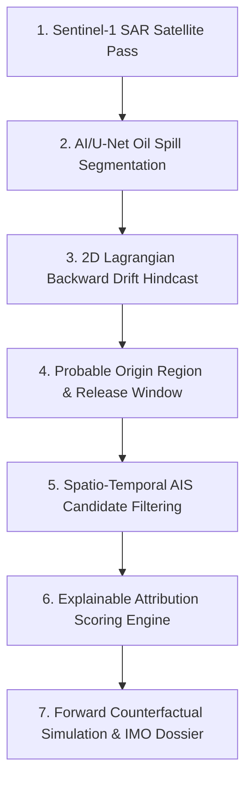

# OCEAN-EYE — Maritime Geospatial Intelligence & Oil Spill Attribution System

> **ECDIS & Satellite Forensics Platform for Autonomous Marine Pollution Attribution**  
> Combining Sentinel-1 SAR imagery, 2D Lagrangian hydrodynamic backward drift models, real-time AIS vessel telemetry, and explainable multi-factor Bayesian attribution.

---

## 🌊 Overview

**OCEAN-EYE** is a defense-grade maritime intelligence platform engineered to detect, track, and attribute offshore marine pollution events. When a synthetic aperture radar (SAR) satellite detects a marine oil slick, the system hindcasts the slick's backward drift using ocean currents and surface winds to reconstruct the probable release origin and temporal window, correlates it with AIS vessel trajectories, runs forward counterfactual simulations to test hypotheses, and compiles a forensically rigorous IMO MARPOL Annex I dossier for human analysts.

---

## 🎯 7-Step Forensics & Attribution Chain



1. **Satellite Acquisition**: Ingests Sentinel-1 C-band SAR scenes with dual-polarization (VV/VH) and look-alike rejection filters.
2. **Spill Segmentation**: Identifies slick polygons, major/minor axes, orientation, contrast ratios (dB), and geometric centroids.
3. **Hydrodynamic Hindcast**: Simulates backward dispersion of particles driven by CMEMS/INCOIS ocean current fields and ECMWF ERA5 winds.
4. **Origin & Release Window**: Calculates probable release ellipse with confidence levels and time brackets (e.g. `06:00–10:00 UTC`).
5. **AIS Filtering**: Funnels thousands of regional AIS vessels down to temporally and spatially intersecting candidates.
6. **Explainable Attribution**: Dynamic 6-factor Bayesian scoring (Proximity 25%, Temporal 20%, Drift 20%, Trajectory 15%, Speed Profile 10%, AIS Continuity 10%).
7. **Counterfactual Validation**: Simulates hypothetical forward release and compares against observed slick geometry before presenting to a human analyst.

---

## 🚀 Key Features

- 🗺️ **Full-Bleed ECDIS Tactical Map**: High-definition bathymetric and dark canvas basemaps with dynamic SVG vessel markers rotated by live heading and speed leaders.
- 🚢 **Live Real-Time AIS**: Dual-clock display (IST & GMT), 1.5s dead-reckoning simulation loop, and live `!AIVDM` NMEA sentence decoder stream.
- 💨 **Metocean Vector Fields**: Live streamlines and vector arrows for INCOIS ocean currents and ECMWF surface winds.
- 🔬 **Interactive 2D Drift Sandbox**: Dynamic time scrubber with $T-1\text{h}$, $T-2\text{h}$, $T-4\text{h}$, $T-8\text{h}$, $T-12\text{h}$, and $T-24\text{h}$ steps.
- ⚖️ **Candidate Comparison & Why This Vessel**: Side-by-side evidence matrix and exact mathematical metric breakdown.
- 📑 **IMO MARPOL Annex I Dossier**: Cryptographic SHA-256 evidence chain with human-in-the-loop analyst verification (`Accept`, `Reject`, `Request More Data`).

---

## 🛠️ Tech Stack

- **Frontend**: React 18, TypeScript, Vite, Tailwind CSS, Leaflet / React-Leaflet, Lucide Icons, Zustand.
- **Typography & Styling**: Syne, Orbitron, Geist, Geist Mono, JetBrains Mono.
- **Backend API**: Python 3.10+, FastAPI, Uvicorn, Pydantic, NumPy, SciPy.

---

## ⚡ Quickstart & Local Setup

### Prerequisites
- Node.js (v18+) & npm
- Python (v3.9+)

### 1. Clone & Setup Frontend
```bash
cd frontend
npm install
npm run dev
```
*Frontend will launch on `http://localhost:5173`*

### 2. Setup Backend API
```bash
cd backend
python3 -m pip install -r requirements.txt
python3 -m uvicorn app.main:app --host 0.0.0.0 --port 8000
```
*Backend API will run on `http://127.0.0.1:8000`*

### 3. One-Click Demo Runner
```bash
chmod +x run_demo.sh
./run_demo.sh
```

---

## ⚖️ License
MIT License. Developed for Marine Environmental Protection and Maritime Geospatial Intelligence.
All Rights Reserved by PUJAN SONANI (pujan.sonani24@vit.edu) .
